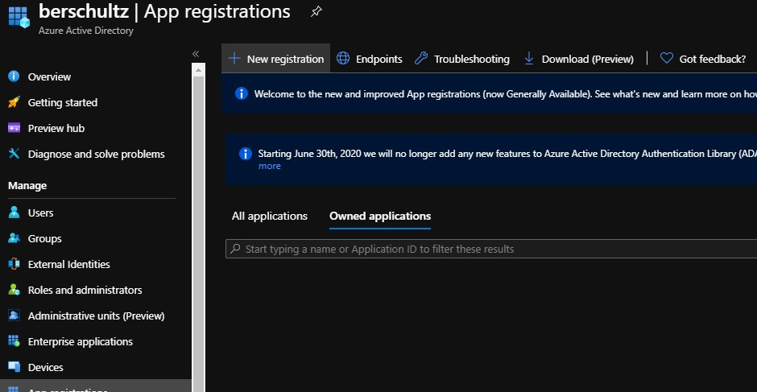
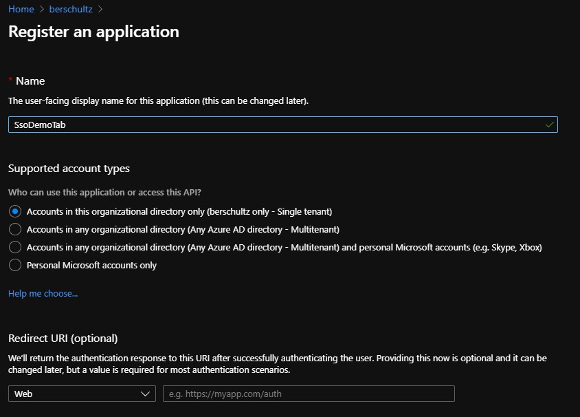
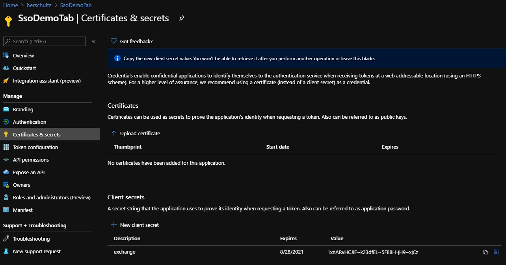
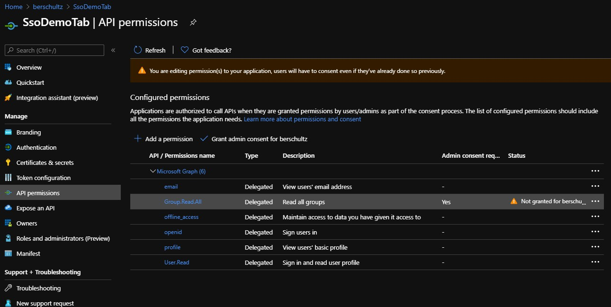
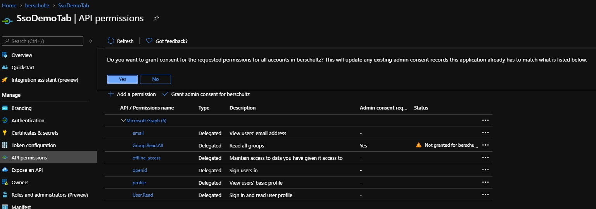
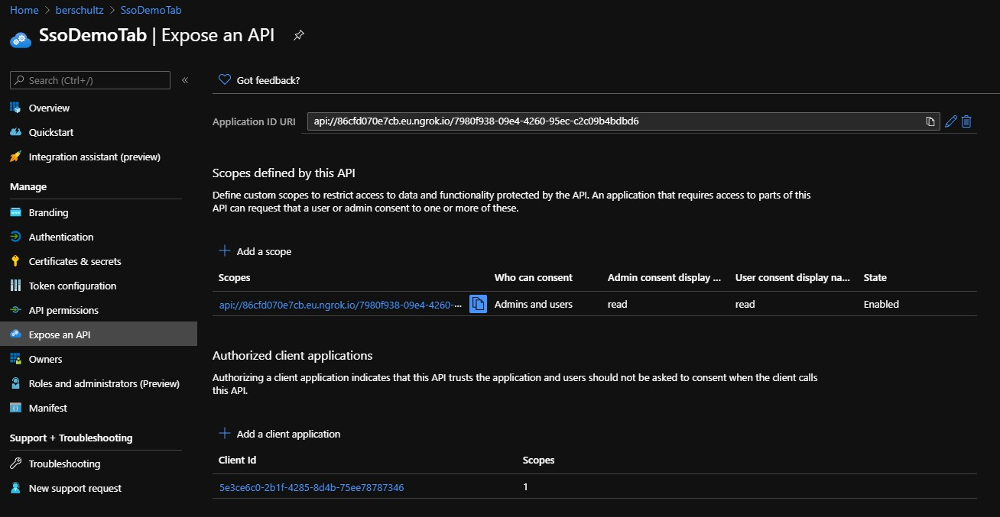

# Azure AD application

Please follow these steps to create an Azure AD application for single-sign on for your Teams app. For more details, please see this [article](https://docs.microsoft.com/en-us/microsoftteams/platform/tabs/how-to/authentication/auth-aad-sso).

## 1. Create the app

## 2. Set name and account types

## 3. Add a client secret

## 4. Set API permissions

## 5. Give consent

## 6. Expose your API

- Scope name: access_as_user
- Client ID for Teams web: 5e3ce6c0-2b1f-4285-8d4b-75ee78787346
- Client ID for Teams mobile/desktop: 1fec8e78-bce4-4aaf-ab1b-5451cc387264

